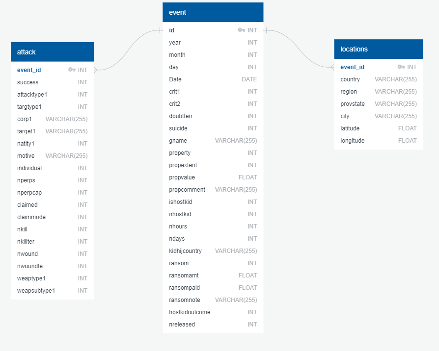
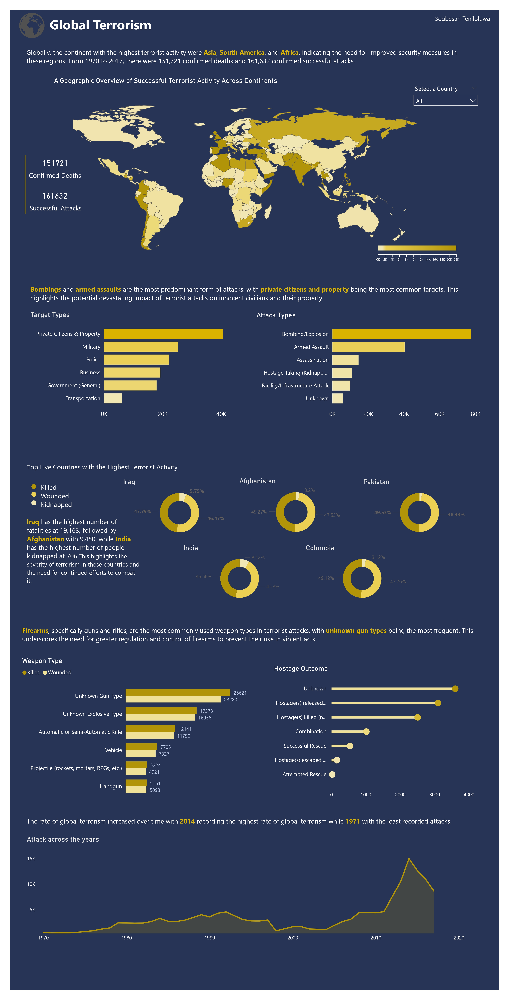

# Global Terrorism Analysis
Welcome to the Global Terrorism Analysis Project! As part of my Data Science and Business Analytics internship at The Sparks Foundation Graduate Rotational Internship Program, I performed an exploratory data analysis on a global terrorism dataset. The project's goal was to analyze and gain insight into terrorist activities around the world.

### Tools Used
The following tools were used for this project:
* Excel worksheet
* QuickDBD
* PostgreSQL
* Python
* Power BI

***

## Data Cleaning
The dataset used for the analysis contained 181,692 rows and 135 columns. The data cleaning process was done on **Excel**, where columns not necessary for the analysis were dropped, negative values less than 1 were replaced with null values, duplicates were removed, and missing values were filled.

***

## Data Normalization
 To reduce redundancy and enhance efficiency, I created two new tables,`locations and attack`, using the` event_id` as the primary key to link them to the original table, specifying the relationship between the new tables and creating an Entity Relationship Diagram (ERD) using **QuickDBD**.

 

***

## Data Analysis
For my analysis phase, I created a database called global_terrorism on **PostgreSQL**. Instead of using traditional methods, I decided to use Python codes below to import my tables into my database. Here the code imports three libraries - pandas, sqlalchemy, and glob - then loops through the three CSV files in the current directory with the Python script, creates three tables in the database with the same name as the CSV files, and inserts the data into the tables. Overall, this code is more efficient than other methods because it reads the data much faster and inserts it into the database much more quickly.

```python
import pandas as pd
from sqlalchemy import create_engine
import glob

# Set up the PostgreSQL connection
POSTGRES_USER = 'postgres'
POSTGRES_PASSWORD = '****'
POSTGRES_HOST = 'localhost'
POSTGRES_PORT = '5432'
POSTGRES_DB = 'global_terrorism'
engine = create_engine(f"postgresql://{POSTGRES_USER}:{POSTGRES_PASSWORD}@{POSTGRES_HOST}:{POSTGRES_PORT}/{POSTGRES_DB}")

# Loop through all CSV files in the current directory and insert them into the PostgreSQL database
for file_path in glob.glob("*.csv"):
    print(file_path)
    # Read the CSV file into a Pandas DataFrame
    df = pd.read_csv(file_path)
    
# Insert the data into a PostgreSQL table
    table_name = file_path[:-4] # Remove the .csv file extension
    df.to_sql(table_name, engine, if_exists='replace', index=False)

# Close the database connection
engine.dispose()
```
After Importing the tables, I explored the data and asked several questions to gain from the data, 
detect patterns, and establish connections between different variables. The questions asked were:
1. What are the top six weapon types used in successful terrorist attacks, based on the number of fatalities and injuries?
2. What is the trend of successful terrorist attacks over the years?
3. Which regions have the highest number of successful terrorist activities?
4. How many successful attacks were carried out, and what was the total number of deaths?
5. Which target types were the most prominent in successful terrorist attacks?
6. What happened to the hostages who were kidnapped after the attacks?
7. What was the most common attack type in successful terrorist attacks?
8. Which countries had the most terrorist attacks, and what were the number of fatalities, kidnappings, and injuries in those countries?

The solutions can be found [here](PostgreSQL-Analysis-Solution.md)

***

## Data Visualizations
After analyzing the data in PostgreSQL, the views were imported into PowerBI to create to visualizations to better understand the data and identify trends and patterns. The dashboard was designed to answer the questions posed during the analysis phase.

 
